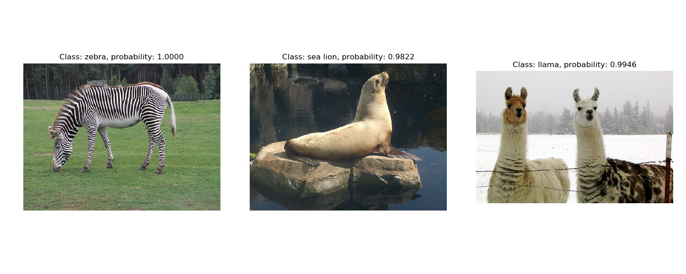
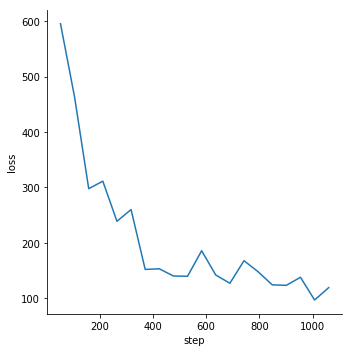
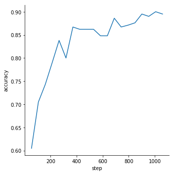
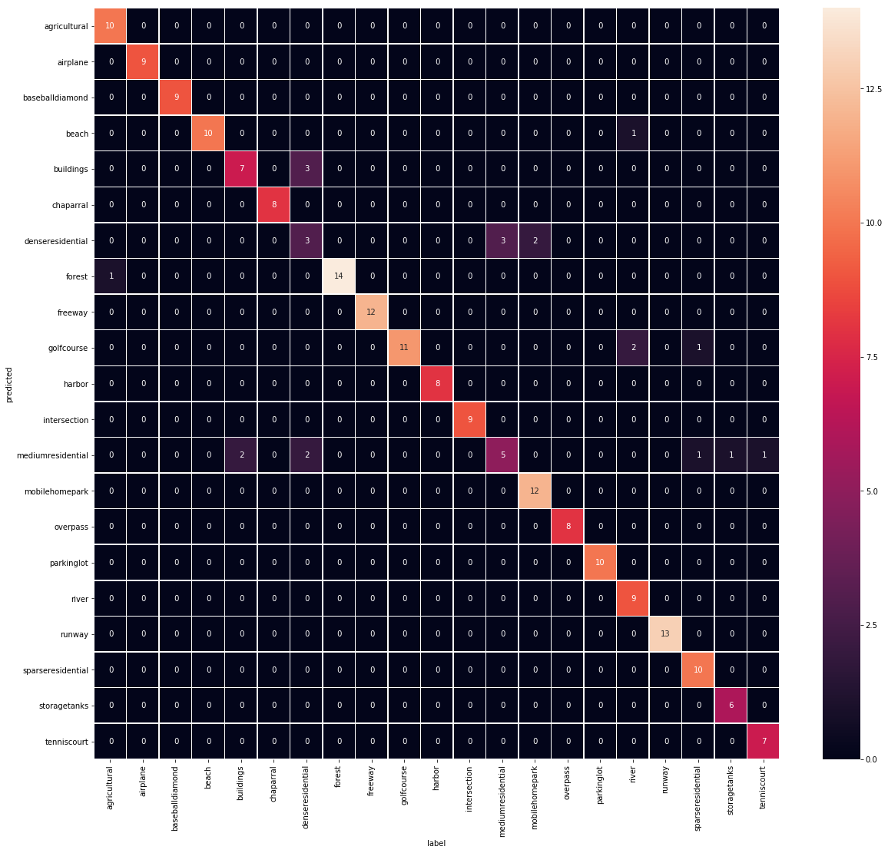

# 使用TensorFlow微调AlexNet

* 项目地址[https://github.com/chuqidecha/fineturn-alexnet-with-tensorflow](https://github.com/chuqidecha/fineturn-alexnet-with-tensorflow)
* 本文中所有用到的数据可以从这里下载[https://pan.baidu.com/s/1-Ijn7E87ZUBcwMmsq2CeYg](https://pan.baidu.com/s/1-Ijn7E87ZUBcwMmsq2CeYg)

## 从caffemode中获取预训练权值
TensorFlow中没有预训练好的AlexNet模型，利用[caffe-tensorflow](https://github.com/ethereon/caffe-tensorflow)工具可以将
在caffe上预训练好的AlexNet模型转成numpy的npy格式。该项目已经一年多没有人维护了，可能存在python、protobuf、tensorflow等版本不
兼容的问题。[这里](https://github.com/chuqidecha/caffe-tensorflow)是我改好的一个版本，使用Python3.6、protobuf3.6、tensorflow1.10版本。
从[Caffe Model Zoo](https://github.com/BVLC/caffe/wiki/Model-Zoo)中可以下载在ImageNet上预训练好的AlexNet模型。

## AlexNet模型结构与参数
AlexNet模型共有5个卷积层，3个全连接层，前两个卷积层和第五个卷积层后有池化层。


1. 卷基层1
输入图像大小为227\*227\*3(BGR)；该层有96（每个GPU48个）个大小为11\*11\*3的卷积核，步长为4，不使用填充。
因此输出特征图大小为55\*55\*96（(227-11)/4+1=55）。参数个数为96\*11\*11\*3+96=34944。
卷基层1之后紧跟一个LRN层，输出大小不变。
2. 池化层1
大小为3\*3，步长为2。因此输出特征图大小为27\*27\*96（(55-3)/2+1=27）
3. 卷基层2
256个大小为5\*5\*48的卷积核（每个GPU各128个，分别作用于池化层1输出的前后48个通道），步长为1，使用填充。
因此输出特征图大小为2个27\*27\*128。参数个数为2\*(128\*5\*5\*48+128)=307456。卷基层2之后也会紧跟一个LRN层。
4. 池化层2
大小为3\*3,步长为2。因此输出特征图大小为2个13\*13\*128（(27-3)/2+1=13）。
5. 卷基层3
有384个大小为3\*3\*256的卷积核（每个GPU各192个，作用于池化层2的所有输出），步长为1，使用填充。
因此输出特征图大小为2个13\*13\*192。参数个数为2\*(192\*3\*3\*256+192)=885120。
6. 卷基层4
有384个大小为3\*3\*192的卷积核（仅作用于当前GPU），步长为1，使用填充。
因此输出特征图大小为2个13\*13\*192。参数个数为2\*(192\*3\*3\*192+192)=663936。
7. 卷基层5
有256个大小为3\*3\*192的卷积核（仅作用于当前GPU），步长为1，使用填充。
因此输出特征图大小为2个13\*13\*128。参数个数为2\*(128\*3*3\*192+128)=442624。
8. 池化层5
大小为3\*3，步长为2。因此输出特征图大小为2个6\*6\*128。
9. 全连接层1
节点数为4096，参数个数为6\*6\*128\*2\*4096+4096=37752832
10. 全连接层2
节点数为4096，参数个数为4096\*4096+4096=16781312
11. 输出层
节点数为1000，参数个数为4096\*1000+1000=4097000


## 在TensorFlow上微调AlexNet的主要代码

### 环境
* Python 3.6.6
* tensorflow 1.10
* opencv 3.4.3.18

### AlexNet实现
```Python
def _conv_with_groups(name_scope, xs, ws, groups, strides, padding):
    '''
    模拟多个GPU
    :param name_scope: 命名空间
    :param xs: 输入Tensor
    :param ws: 权值Tensor
    :param groups: GPU数目
    :param strides: 步长
    :param padding: 边缘填充方式
    :return:
    '''
    with tf.name_scope(name_scope):
        ws_groups = tf.split(value=ws, num_or_size_splits=groups, axis=3)
        xs_groups = tf.split(value=xs, num_or_size_splits=groups, axis=3)
        conv_groups = [tf.nn.conv2d(x, w, strides, padding=padding) for w, x in zip(ws_groups, xs_groups)]
        conv = tf.concat(values=conv_groups, axis=3)
    return conv

def inference(input_tensor, output_dim, keep_prob, regularizer=None):
    '''
    AlexNet模型实现
    :param input_tensor: 输入[None,227,227,3]
    :param output_dim: 分类数
    :param keep_prob: dropout概率
    :param regularizer: 正则化项
    :return:
    '''
    with tf.variable_scope("conv1"):
        weights = tf.get_variable('weights', [11, 11, 3, 96], initializer=tf.truncated_normal_initializer(stddev=0.1))
        biases = tf.get_variable('biases', [96], initializer=tf.constant_initializer(0.0))
        conv1 = tf.nn.bias_add(tf.nn.conv2d(input_tensor, weights, [1, 4, 4, 1], padding="VALID"), biases)

    with tf.name_scope("relu1"):
        relu1 = tf.nn.relu(conv1)

    with tf.name_scope("lrn1"):
        lrn1 = tf.nn.lrn(relu1, depth_radius=2, bias=1, alpha=0.00002, beta=0.75)
    with tf.name_scope("pool1"):
        pool1 = tf.nn.max_pool(lrn1, [1, 3, 3, 1], [1, 2, 2, 1], padding="VALID")

    with tf.variable_scope("conv2"):
        weights = tf.get_variable('weights', [5, 5, 48, 256], initializer=tf.truncated_normal_initializer(stddev=0.1))
        biases = tf.get_variable('biases', [256], initializer=tf.constant_initializer(0.0))
        conv2 = tf.nn.bias_add(_conv_with_groups("conv2-groups", pool1, weights, 2, [1, 1, 1, 1], padding="SAME"),
                               biases)

    with tf.name_scope("relu2"):
        relu2 = tf.nn.relu(conv2)
    with tf.name_scope("lrn2"):
        lrn2 = tf.nn.lrn(relu2, depth_radius=2, bias=1, alpha=0.00002, beta=0.75)

    with tf.name_scope("pool2"):
        pool2 = tf.nn.max_pool(lrn2, [1, 3, 3, 1], [1, 2, 2, 1], padding="VALID")

    with tf.variable_scope("conv3"):
        weights = tf.get_variable('weights', [3, 3, 256, 384], initializer=tf.truncated_normal_initializer(stddev=0.1))
        biases = tf.get_variable('biases', [384], initializer=tf.constant_initializer(0.0))
        conv3 = tf.nn.bias_add(tf.nn.conv2d(pool2, weights, [1, 1, 1, 1], padding="SAME"), biases)

    with tf.name_scope("relu3"):
        relu3 = tf.nn.relu(conv3)

    with tf.variable_scope("conv4"):
        weights = tf.get_variable('weights', [3, 3, 192, 384], initializer=tf.truncated_normal_initializer(stddev=0.1))
        biases = tf.get_variable('biases', [384], initializer=tf.constant_initializer(0.0))
        conv4 = tf.nn.bias_add(_conv_with_groups("conv4-groups", relu3, weights, 2, [1, 1, 1, 1], padding="SAME"),
                               biases)

    with tf.name_scope("relu4"):
        relu4 = tf.nn.relu(conv4)

    with tf.variable_scope("conv5"):
        weights = tf.get_variable('weights', [3, 3, 192, 256], initializer=tf.truncated_normal_initializer(stddev=0.1))
        biases = tf.get_variable('biases', [256], initializer=tf.constant_initializer(0.0))
        conv5 = tf.nn.bias_add(_conv_with_groups("conv5-groups", relu4, weights, 2, [1, 1, 1, 1], padding="SAME"),
                               biases)

    with tf.name_scope("relu5"):
        relu5 = tf.nn.relu(conv5)

    with tf.name_scope("pool5"):
        pool5 = tf.nn.max_pool(relu5, [1, 3, 3, 1], [1, 2, 2, 1], padding="VALID")

    with tf.variable_scope("fc6"):
        weights = tf.get_variable('weights', [9216, 4096], initializer=tf.truncated_normal_initializer(stddev=0.1))
        biases = tf.get_variable('biases', [4096], initializer=tf.constant_initializer(0.0))
        flattened = tf.reshape(pool5, [-1, 6 * 6 * 256])
        fc6 = tf.nn.xw_plus_b(flattened, weights, biases)
        if regularizer is not None:
            tf.add_to_collection("losses", regularizer(weights))

    with tf.name_scope("relu6"):
        relu6 = tf.nn.relu(fc6)

    with tf.name_scope("dropout6"):
        relu6 = tf.nn.dropout(relu6, keep_prob)

    with tf.variable_scope("fc7"):
        weights = tf.get_variable('weights', [4096, 4096], initializer=tf.truncated_normal_initializer(stddev=0.1))
        biases = tf.get_variable('biases', [4096], initializer=tf.constant_initializer(0.0))
        fc7 = tf.nn.xw_plus_b(relu6, weights, biases)
        if regularizer is not None:
            tf.add_to_collection("losses", regularizer(weights))

    with tf.name_scope("relu7"):
        relu7 = tf.nn.relu(fc7)

    with tf.name_scope("dropout7"):
        relu7 = tf.nn.dropout(relu7, keep_prob)

    with tf.variable_scope("fc8"):
        weights = tf.get_variable('weights', [4096, output_dim],
                                  initializer=tf.truncated_normal_initializer(stddev=0.1))
        biases = tf.get_variable('biases', [output_dim], initializer=tf.constant_initializer(0.0))
        if regularizer is not None:
            tf.add_to_collection("losses", regularizer(weights))
        fc8 = tf.nn.xw_plus_b(relu7, weights, biases)

    return fc8
```

### 验证模型
为了测试模型是否正确，并且参数是否被正确赋值，可以创建一个ImageNet原始模型（最后一层有1000个类别）并将微调的网络层设置为空（为了从caffemodel中加载所有参数）。
从原始ImageNet数据集中随机抽取了几张图片进行预测分类，下面是分类结果：

从上图可以看出，模型正确并且参数被正确赋值。分类代码参考[validate_alexnet_on_imagenet.py](./src/validate_alexnet_on_imagenet.py)

### 微调网络
微调网络代码参考[fineturn.py](./src/fineturn.py)，需要注意的是，采用优化算法时，一定要设置var_list参数，否则会微调所有网路参数。
```Python
with tf.name_scope('train'):
        trainable_variables = [v for v in tf.trainable_variables() if v.name.split('/')[0] in train_layers]
        train_step = tf.train.GradientDescentOptimizer(learning_rate).minimize(loss, global_step=global_step,
                                                                               var_list=trainable_variables)
```
## 在UCMerced_LandUse遥感数据集上微和测试
UCMerced\_LandUse数据集共有21个类别，每个类别100幅。数据集详情见[http://weegee.vision.ucmerced.edu/datasets/landuse.html](http://weegee.vision.ucmerced.edu/datasets/landuse.html)。

实验中，将数据集按照0.8,0.1,0.1的权值分成训练、测试、验证集，并转换成tfrecord格式。并固定卷积层参数，在训练集上微调全连接层，参数参见[setting.py](./src/setting.py)。保存每一个epoch的模型，在验证集上测试，选择最好的模型，在测试集上完成测试。

* 验证集上的loss和accuracy





* 测试集上的准确率


|predicted|agricultural|airplane|baseballdiamond|beach|buildings|chaparral|denseresidential|forest|freeway|golfcourse|harbor|intersection|mediumresidential|mobilehomepark|overpass|parkinglot|river|runway|sparseresidential|storagetanks|tenniscourt|准确率|
|---|---|---|---|---|---|---|---|---|---|---|---|---|---|---|---|---|---|---|---|---|---|---|
|agricultural|10|0|0|0|0|0|0|0|0|0|0|0|0|0|0|0|0|0|0|0|0|1.00|
|airplane|0|9|0|0|0|0|0|0|0|0|0|0|0|0|0|0|0|0|0|0|0|1.00|
|baseballdiamond|0|0|9|0|0|0|0|0|0|0|0|0|0|0|0|0|0|0|0|0|0|1.00|
|beach|0|0|0|10|0|0|0|0|0|0|0|0|0|0|0|0|1|0|0|0|0|0.91|
|buildings|0|0|0|0|7|0|3|0|0|0|0|0|0|0|0|0|0|0|0|0|0|0.70|
|chaparral|0|0|0|0|0|8|0|0|0|0|0|0|0|0|0|0|0|0|0|0|0|1.00|
|denseresidential|0|0|0|0|0|0|3|0|0|0|0|0|3|2|0|0|0|0|0|0|0|0.38|
|forest|1|0|0|0|0|0|0|14|0|0|0|0|0|0|0|0|0|0|0|0|0|0.93|
|freeway|0|0|0|0|0|0|0|0|12|0|0|0|0|0|0|0|0|0|0|0|0|1.00|
|golfcourse|0|0|0|0|0|0|0|0|0|11|0|0|0|0|0|0|2|0|1|0|0|0.73|
|harbor|0|0|0|0|0|0|0|0|0|0|8|0|0|0|0|0|0|0|0|0|0|1.00|
|intersection|0|0|0|0|0|0|0|0|0|0|0|9|0|0|0|0|0|0|0|0|0|1.00|
|mediumresidential|0|0|0|0|2|0|2|0|0|0|0|0|5|0|0|0|0|0|1|1|1|0.42|
|mobilehomepark|0|0|0|0|0|0|0|0|0|0|0|0|0|12|0|0|0|0|0|0|0|1.00|
|overpass|0|0|0|0|0|0|0|0|0|0|0|0|0|0|8|0|0|0|0|0|0|1.00|
|parkinglot|0|0|0|0|0|0|0|0|0|0|0|0|0|0|0|10|0|0|0|0|0|1.00|
|river|0|0|0|0|0|0|0|0|0|0|0|0|0|0|0|0|9|0|0|0|0|1.00|
|runway|0|0|0|0|0|0|0|0|0|0|0|0|0|0|0|0|0|13|0|0|0|1.00|
|sparseresidential|0|0|0|0|0|0|0|0|0|0|0|0|0|0|0|0|0|0|10|0|0|1.00|
|storagetanks|0|0|0|0|0|0|0|0|0|0|0|0|0|0|0|0|0|0|0|6|0|1.00|
|tenniscourt|0|0|0|0|0|0|0|0|0|0|0|0|0|0|0|0|0|0|0|0|7|1.00|
|召回率|0.91|1.00|1.00|1.00|0.78|1.00|0.38|1.00|1.00|1.00|1.00|1.00|0.62|0.86|1.00|1.00|0.75|1.00|0.83|0.86|0.88||

## 踩过的坑

### tf.get_variable重用变量时并不能修改trainable属性
```
import tensorflow as tf

if __name__ == '__main__':
    with tf.variable_scope("test"):
        weights = tf.get_variable("weights", shape=[10], initializer=tf.truncated_normal_initializer(stddev=0.1)) # 变量可训练的
        baises = tf.get_variable("baises", initializer=tf.constant(1.0),trainable=False) # 变量不可训练

    with tf.variable_scope("test",reuse=True):
        weights = tf.get_variable("weights", shape=[10], initializer=tf.truncated_normal_initializer(stddev=0.1),trainable=False)
        baises = tf.get_variable("baises", initializer=tf.constant(1.0),trainable=True)

    init = tf.global_variables_initializer()
    with tf.Session() as sess:
        sess.run(init)
        print(tf.trainable_variables())
```

> [output]:[<tf.Variable 'test/weights:0' shape=(10,) dtype=float32_ref>]

trainable集合中中的变量并没有发生变化。因此优化阶段调用Optimizer的minimize方法必须显示的给出var_list的参数，而不能使用默认的trainable集合。

```
    with tf.name_scope('train'):
        var_list = [v for v in tf.trainable_variables() if v.name.split('/')[0] in train_layers]

        # Get gradients of all trainable variables
        gradients = tf.gradients(loss, var_list)
        gradients = list(zip(gradients, var_list))

        # Create optimizer and apply gradient descent to the trainable variables
        optimizer = tf.train.GradientDescentOptimizer(learning_rate)
        train_op = optimizer.apply_gradients(grads_and_vars=gradients, global_step=global_step)

        # tf.train.GradientDescentOptimizer(learning_rate).minimize(loss,var_list=gradients, global_step=global_step)
```

### global_step参数的更新
只有调用Optimizer的minimize方法完成参数更新之后global\_step参数才会+1， 学习率、移动滑动平局等地方需要使用glob\_step参数但并不会更改其值。


### LRN(Local Response Normalization)在caffe和tensorflow中实现上的差异

tensorflow的实现公式：
```math
b^{i}_{x,y}=a^{i}_{x,y}/(k+\alpha\sum_{j=max(o,i-r)}^{min(i+r,N-1)}(a^{j}_{x,y})^2)^{\beta}
```
caffe的实现公式：
```math
b^{i}_{x,y}=a^{i}_{x,y}/(k+\alpha/n\sum_{j=max(o,i-n/2)}^{min(i+n/2,N-1)}(a^{j}_{x,y})^2)^{\beta}
```

* a表示第i个核在位置（x,y）运用激活函数ReLU后的输出
* n(或2r+1)是同一位置上临近的kernal map的数目
* N是kernal的总数
* `$k,\alpha,\beta$`都是超参数


caffe中的local\_size必须是奇数，等于公式中的n，而tensorflow中的depth\_radius等于n/2，因此二者的关系为：local\_size = 2*depth\_radius + 1。

alpha的定义caffe要在实际的系数上乘以local\_size